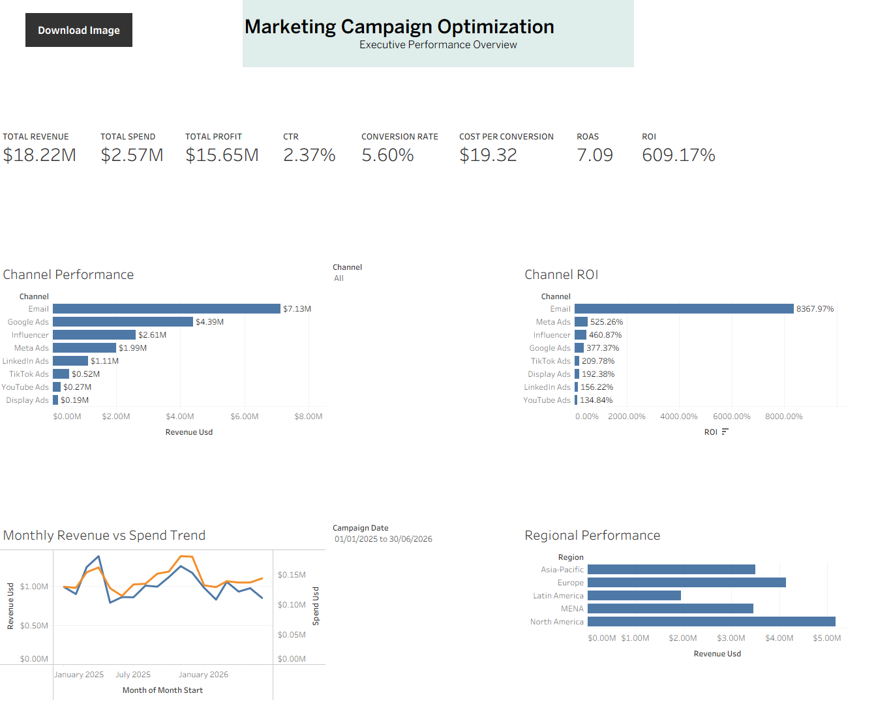
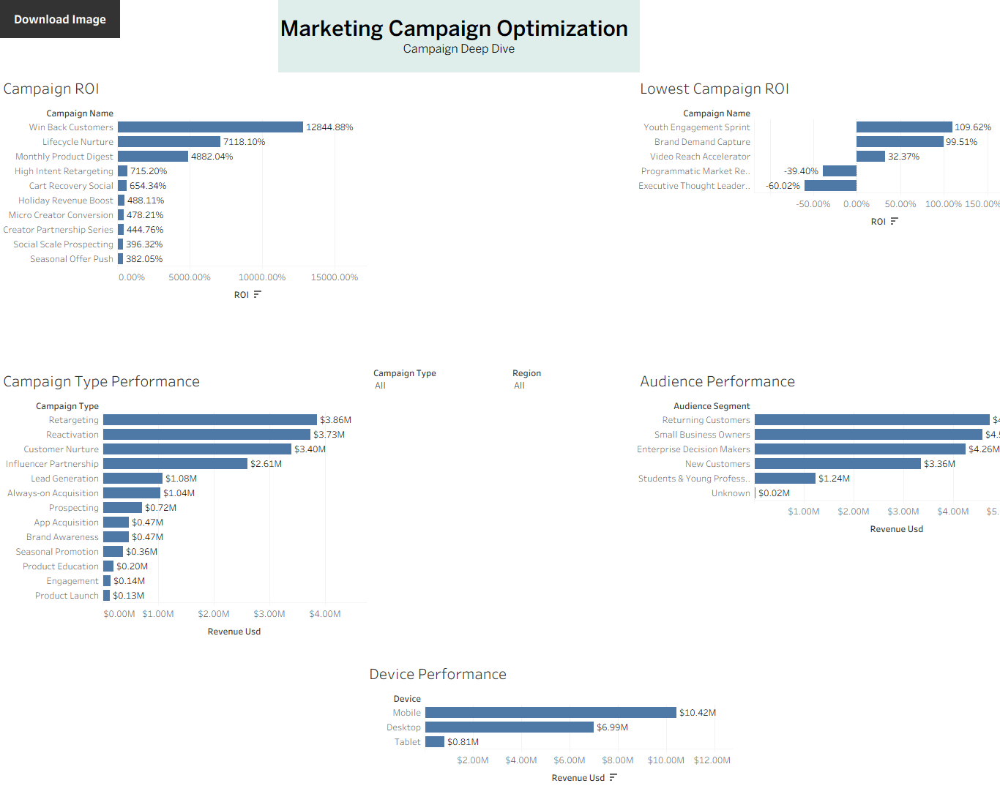

# Marketing Campaign Optimization

## Project Overview

This project analyzes marketing campaign performance using **PostgreSQL, SQL, and Tableau** to identify the channels, campaigns, audience segments, regions, devices, and campaign types that generate the strongest business results.

The analysis focuses on improving marketing budget allocation by evaluating performance across revenue, profitability, engagement, conversions, acquisition cost, ROAS, and ROI.

The dataset contains **6,252 raw records** covering marketing activity from **January 2025 to June 2026**. After data cleaning and duplicate removal, the final analytical dataset contains **6,240 records** across **24 campaigns, 8 marketing channels, and 5 geographic regions**.

> This is a portfolio project built with a realistic marketing campaign dataset for analytical demonstration.

---
## Dataset Source

The dataset used in this project is a synthetic marketing campaign dataset created for portfolio and analytical demonstration purposes.

It was designed to simulate realistic marketing campaign performance across multiple channels, campaigns, audience segments, regions, devices, and campaign types.

The dataset does not contain real customer information or personally identifiable data.

---

## Business Problem

The company invests across multiple marketing channels and campaigns but lacks a clear understanding of which activities generate the highest engagement, conversions, revenue, and return on investment.

The project was designed to answer questions such as:

- Which marketing channels generate the highest ROI?
- Which campaigns achieve the strongest conversion and profitability performance?
- Which campaigns have high spending but weak returns?
- What is the cost per conversion across channels and segments?
- Which audience segments and regions generate the most value?
- How does marketing performance change over time?
- Which campaigns should receive additional budget?
- Which campaigns should be optimized, reduced, or paused?

---

## Tools Used

- **PostgreSQL**
- **pgAdmin**
- **SQL**
- **Tableau**
- **CSV**
- **GitHub**

---
## How to Reproduce

1. Download or clone this repository.

2. Create a PostgreSQL database named:

   `marketing_campaign_db`

3. Run:

   `02_SQL/01_create_raw_table.sql`

   to create the raw marketing campaign table.

4. Import:

   `01_Raw_Data/marketing_campaign_raw_data.csv`

   into the `marketing_campaigns_raw` table using pgAdmin:

   - Format: CSV
   - Encoding: UTF8
   - Header: Yes
   - Delimiter: `,`

5. Run the remaining SQL scripts in numerical order:

   `02_data_quality_assessment.sql`  
   `03_clean_marketing_data.sql`  
   `04_validate_clean_data.sql`  
   `05_overall_marketing_kpis.sql`  
   `06_channel_performance_analysis.sql`  
   `07_campaign_performance_analysis.sql`  
   `08_audience_segment_analysis.sql`  
   `09_region_performance_analysis.sql`  
   `10_monthly_trend_analysis.sql`  
   `11_device_and_campaign_type_analysis.sql`  
   `12_create_tableau_view.sql`

6. Open the Tableau workbook:

   [Download Tableau Workbook](04_Tableau/Marketing_Campaign_Optimization_Final.twbx)

7. The Tableau-ready dataset is also available at:

   `03_Clean_Data/marketing_campaign_tableau.csv`

---

## Project Workflow

### 1. Raw Data Preparation
The raw marketing campaign dataset was preserved in its original form for reproducibility and auditability.

### 2. Data Quality Assessment
SQL was used to evaluate:

- Missing values
- Duplicate record IDs
- Channel naming inconsistencies
- Region naming inconsistencies
- Invalid numerical values
- Marketing metric relationships
- Dataset date range

### 3. Data Cleaning
The cleaned dataset was created by:

- Removing **12 duplicate records**
- Standardizing marketing channel names
- Standardizing region names
- Replacing **14 missing audience segment values** with `Unknown`
- Trimming unnecessary spaces
- Adding primary-key and data-quality constraints
- Validating marketing metric relationships

### 4. SQL Analysis
SQL analysis covered:

- Overall marketing KPIs
- Channel performance
- Individual campaign performance
- Audience segment performance
- Regional performance
- Monthly trends
- Device performance
- Campaign type performance
- Tableau-ready analytical view creation

### 5. Tableau Visualization
Two interactive dashboards were created:

- **Executive Overview**
- **Campaign Deep Dive**

The dashboards include filters and visual analysis across channels, campaigns, regions, audience segments, devices, and campaign types.

---

## Key Performance Indicators

| KPI | Result |
|---|---:|
| Total Spend | $2.57M |
| Total Revenue | $18.22M |
| Total Profit | $15.65M |
| CTR | 2.37% |
| Conversion Rate | 5.60% |
| Cost per Conversion | $19.32 |
| ROAS | 7.09 |
| ROI | 609.17% |

---

## Key Insights

### Channel Performance

- **Email** was the most efficient marketing channel and generated the highest ROI and ROAS.
- **Google Ads** contributed strong revenue and conversion volume.
- **Meta Ads** and **Influencer** campaigns also generated strong positive returns.
- **YouTube Ads** was the least efficient major channel, although it remained profitable.

### Campaign Performance

- **Win Back Customers** generated the strongest campaign ROI.
- **Lifecycle Nurture** and **Monthly Product Digest** were also top-performing campaigns.
- **Executive Thought Leadership** and **Programmatic Market Reach** generated negative ROI and should be reviewed, reduced, or paused until performance improves.

### Audience Performance

- **Returning Customers** generated the highest revenue and conversion volume.
- **Enterprise Decision Makers** achieved the highest ROI.
- **Small Business Owners** also represented a strong high-value segment.
- **Students & Young Professionals** showed weaker efficiency and higher acquisition costs.

### Regional Performance

- **North America** generated the highest total revenue and conversion volume.
- **Latin America** achieved the highest ROI.
- **Asia-Pacific** also showed strong efficiency and potential for increased investment.
- North America should retain strong investment while focusing on reducing cost per conversion.

### Device Performance

- **Mobile** generated the highest revenue and conversion volume.
- **Desktop** achieved the strongest efficiency and lower cost per conversion.
- **Tablet** produced the weakest performance among the three device categories.

### Time-Based Performance

- **April 2025** generated the highest monthly revenue.
- **November 2025** generated the highest conversion volume.
- **March 2025** showed the strongest month-over-month revenue growth.
- **May 2025** experienced a significant revenue decline compared with the previous month.
- **June 2026** showed weaker ROAS than earlier periods and should be monitored.

---

## Budget Optimization Recommendations

1. Increase investment gradually in high-efficiency channels such as **Email** while monitoring scalability.
2. Maintain strong investment in **Google Ads** and **Mobile** because of their contribution to revenue and conversion volume.
3. Expand high-performing audience segments such as **Returning Customers**, **Enterprise Decision Makers**, and **Small Business Owners**.
4. Review and reduce budget for campaigns with negative ROI, especially **Executive Thought Leadership** and **Programmatic Market Reach**.
5. Improve targeting, messaging, and creative strategy for lower-performing audience and device segments.
6. Protect high-volume markets such as **North America** while reducing acquisition costs.
7. Test controlled budget increases in **Latin America** and **Asia-Pacific** because of their strong efficiency.

---

## Tableau Dashboards

### Executive Overview




### Campaign Deep Dive



---

## Repository Structure

```text
Marketing_Campaign_Optimization
│
├── README.md
├── .gitignore
│
├── 01_Raw_Data
│   └── marketing_campaign_raw_data.csv
│
├── 02_SQL
│   ├── 01_create_raw_table.sql
│   ├── 02_data_quality_assessment.sql
│   ├── 03_clean_marketing_data.sql
│   ├── 04_validate_clean_data.sql
│   ├── 05_overall_marketing_kpis.sql
│   ├── 06_channel_performance_analysis.sql
│   ├── 07_campaign_performance_analysis.sql
│   ├── 08_audience_segment_analysis.sql
│   ├── 09_region_performance_analysis.sql
│   ├── 10_monthly_trend_analysis.sql
│   ├── 11_device_and_campaign_type_analysis.sql
│   └── 12_create_tableau_view.sql
│
├── 03_Clean_Data
│   └── marketing_campaign_tableau.csv
│
├── 04_Tableau
│   └── Marketing_Campaign_Optimization_Final.twbx
│
├── 05_Images
│   ├── Executive_Overview.png
│   └── Campaign_Deep_Dive.png
│
└── 06_Documentation
    ├── Project_Brief.txt
    ├── Data_Dictionary.md
    └── Key_Insights.md
```

---

## SQL Files

The SQL workflow is organized sequentially so the project can be followed from raw table creation through cleaning, analysis, and Tableau preparation.

1. `01_create_raw_table.sql`
2. `02_data_quality_assessment.sql`
3. `03_clean_marketing_data.sql`
4. `04_validate_clean_data.sql`
5. `05_overall_marketing_kpis.sql`
6. `06_channel_performance_analysis.sql`
7. `07_campaign_performance_analysis.sql`
8. `08_audience_segment_analysis.sql`
9. `09_region_performance_analysis.sql`
10. `10_monthly_trend_analysis.sql`
11. `11_device_and_campaign_type_analysis.sql`
12. `12_create_tableau_view.sql`

---

## Dashboard Features

### Executive Overview
- Overall marketing KPI cards
- Channel revenue performance
- Channel ROI analysis
- Monthly revenue vs spend trend
- Regional performance
- Interactive date and channel filters

### Campaign Deep Dive
- Top campaigns by ROI
- Lowest-performing campaigns by ROI
- Campaign type performance
- Audience segment performance
- Device performance
- Interactive campaign type and region filters

---

## Data Dictionary

A complete data dictionary is available here:

[View Data Dictionary](06_Documentation/Data_Dictionary.md)

---

## Key Insights Documentation

Detailed analytical findings and recommendations are available here:

[View Key Insights](06_Documentation/Key_Insights.md)

---

## Conclusion

The analysis shows that marketing performance varies significantly by channel, campaign, audience, region, and device. The strongest opportunities are concentrated in high-efficiency channels such as Email, high-value customer segments, and selected geographic markets.

The project demonstrates an end-to-end analytics workflow from raw data quality assessment and SQL transformation to KPI analysis, interactive Tableau dashboards, and actionable budget optimization recommendations.
